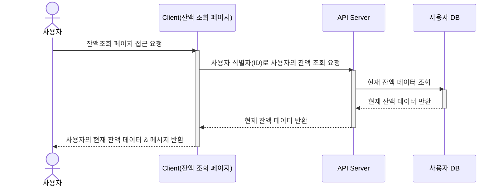
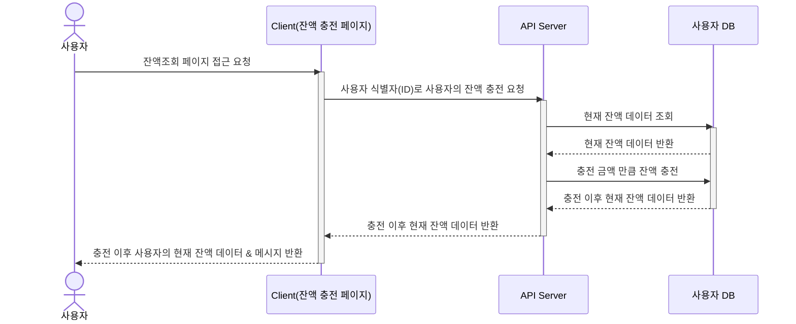

# 시퀀스 다이어그램

## 잔액 조회 API

```mermaid
sequenceDiagram
	actor 사용자
	participant Client(잔액 조회 페이지)
	participant API Server
	participant 사용자 DB
	사용자->>Client(잔액 조회 페이지): 잔액조회 페이지 접근 요청
	activate Client(잔액 조회 페이지)
	
	Client(잔액 조회 페이지)->>API Server: 사용자 식별자(ID)로 사용자의 잔액 조회 요청
	activate API Server
	API Server->>사용자 DB: 현재 잔액 데이터 조회
	
	activate 사용자 DB
	사용자 DB-->>API Server: 현재 잔액 데이터 반환
	deactivate 사용자 DB
	API Server-->>Client(잔액 조회 페이지): 현재 잔액 데이터 반환
	deactivate API Server
	Client(잔액 조회 페이지)-->>사용자: 사용자의 현재 잔액 데이터 & 메시지 반환
	deactivate Client(잔액 조회 페이지)
```

## 잔액 충전 API

```mermaid
sequenceDiagram
	actor 사용자
	participant Client(잔액 충전 페이지)
	participant API Server
	participant 사용자 DB
	사용자->>Client(잔액 충전 페이지): 잔액조회 페이지 접근 요청
	activate Client(잔액 충전 페이지)
	
	Client(잔액 충전 페이지)->>API Server: 사용자 식별자(ID)로 사용자의 잔액 충전 요청
	activate API Server
	API Server->>사용자 DB: 현재 잔액 데이터 조회
	
	activate 사용자 DB
	사용자 DB-->>API Server: 현재 잔액 데이터 반환
	API Server->>사용자 DB: 충전 금액 만큼 잔액 충전
	사용자 DB-->>API Server: 충전 이후 현재 잔액 데이터 반환
	deactivate 사용자 DB
	API Server-->>Client(잔액 충전 페이지): 충전 이후 현재 잔액 데이터 반환
	deactivate API Server
	Client(잔액 충전 페이지)-->>사용자: 충전 이후 사용자의 현재 잔액 데이터 & 메시지 반환
	deactivate Client(잔액 충전 페이지)
	
```
