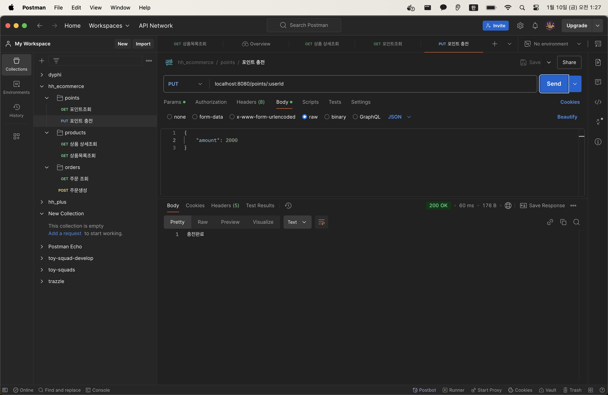
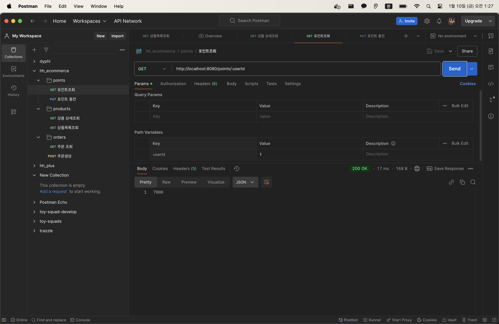
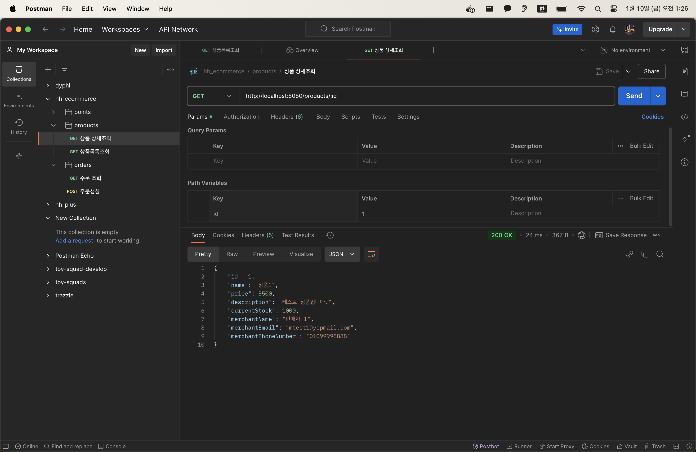
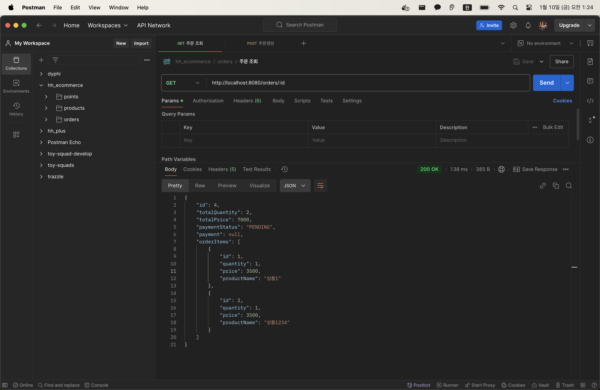
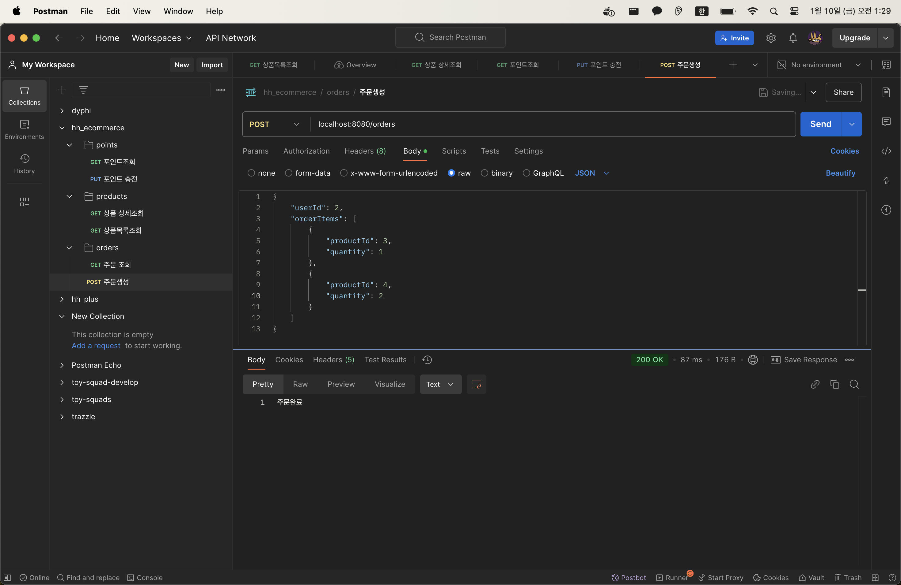

# 이커머스 프로젝트 

### [apiDog: swagger 문서 링크](https://kdiv77myy3.apidog.io/)


## 주요 API

### 잔액조회 / 잔액충전 API
- 커스텀 에러와 커스텀에러 핸들러 생성
- [잔액조회/잔액충전 기능구현 및 테스트케이스작성](https://github.com/loveAlakazam/hh-e-commerce/pull/12)
- [잔액조회/잔액충전 컨트롤러 테스트케이스 작성](https://github.com/loveAlakazam/hh-e-commerce/pull/14)

> 잔액 충전: `[POST] /points`


> 잔액 조회: `[GET] /points/:userId`



### 단일 상품 상세정보 조회 API

- [단일상품 상세정보 조회 및 테스트케이스 작성](https://github.com/loveAlakazam/hh-e-commerce/pull/22)

> 단일 상품 상세정보 조회: `[GET] /products/:id`


### 상품 목록 조회 API

- [상품목록 조회 API 기능구현 및 테스트케이스 작성](https://github.com/loveAlakazam/hh-e-commerce/pull/23)

> 상품목록 조회: `[GET] /products?page=1`
```json
{
    "content": [
        {
            "id": 1,
            "name": "상품1",
            "price": 3500,
            "description": "테스트 상품입니다.",
            "currentStock": 1000,
            "merchantName": "판매자 1",
            "merchantEmail": "mtest1@yopmail.com",
            "merchantPhoneNumber": "01099998888"
        },
        {
            "id": 2,
            "name": "상품1234",
            "price": 3500,
            "description": "테스트 상품 1입니다.",
            "currentStock": 100,
            "merchantName": "판매자 1",
            "merchantEmail": "merchant1@yopmail.com",
            "merchantPhoneNumber": "01099998888"
        },
        {
            "id": 3,
            "name": "상품2",
            "price": 4500,
            "description": "테스트 상품 2입니다.",
            "currentStock": 200,
            "merchantName": "판매자 2",
            "merchantEmail": "merchant2@yopmail.com",
            "merchantPhoneNumber": "01088887777"
        },
        {
            "id": 4,
            "name": "상품3",
            "price": 5500,
            "description": "테스트 상품 3입니다.",
            "currentStock": 300,
            "merchantName": "판매자 3",
            "merchantEmail": "merchant3@yopmail.com",
            "merchantPhoneNumber": "01077776666"
        },
        {
            "id": 5,
            "name": "상품4",
            "price": 6500,
            "description": "테스트 상품 4입니다.",
            "currentStock": 400,
            "merchantName": "판매자 4",
            "merchantEmail": "merchant4@yopmail.com",
            "merchantPhoneNumber": "01066665555"
        },
        {
            "id": 6,
            "name": "상품5",
            "price": 7500,
            "description": "테스트 상품 5입니다.",
            "currentStock": 500,
            "merchantName": "판매자 5",
            "merchantEmail": "merchant5@yopmail.com",
            "merchantPhoneNumber": "01055554444"
        },
        {
            "id": 7,
            "name": "상품6",
            "price": 8500,
            "description": "테스트 상품 6입니다.",
            "currentStock": 600,
            "merchantName": "판매자 6",
            "merchantEmail": "merchant6@yopmail.com",
            "merchantPhoneNumber": "01044443333"
        },
        {
            "id": 8,
            "name": "상품7",
            "price": 9500,
            "description": "테스트 상품 7입니다.",
            "currentStock": 700,
            "merchantName": "판매자 7",
            "merchantEmail": "merchant7@yopmail.com",
            "merchantPhoneNumber": "01033332222"
        },
        {
            "id": 9,
            "name": "상품8",
            "price": 10500,
            "description": "테스트 상품 8입니다.",
            "currentStock": 800,
            "merchantName": "판매자 8",
            "merchantEmail": "merchant8@yopmail.com",
            "merchantPhoneNumber": "01022221111"
        },
        {
            "id": 10,
            "name": "상품9",
            "price": 11500,
            "description": "테스트 상품 9입니다.",
            "currentStock": 900,
            "merchantName": "판매자 9",
            "merchantEmail": "merchant9@yopmail.com",
            "merchantPhoneNumber": "01011110000"
        }
    ],
    "totalElements": 21,
    "totalPages": 3,
    "offset": 0,
    "limit": 10
}
```

### 주문 API

- [주문생성/주문조회 API 기능구현 및 테스트케이스 작성](https://github.com/loveAlakazam/hh-e-commerce/pull/24)

> 주문단건 정보조회: `[GET] /orders/:id`

> 
<br>

> 주문 생성: `[POST] /orders`


### 결제 API

### 상위 상품 조회 API

### 선착순 쿠폰기능 API

### CI/CD 파이프라인